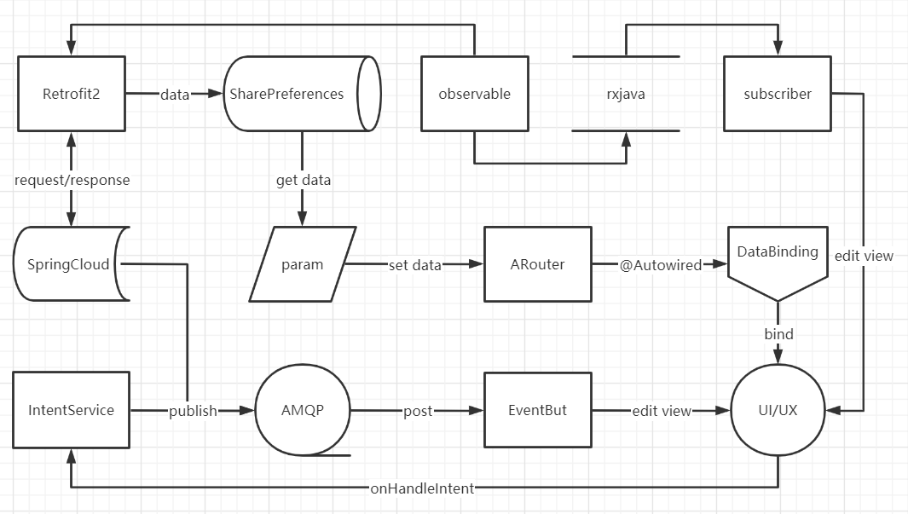

# 2021年基于Android MVVM框架的前端设计

## What's Android MVVM architecture?


## 我的MVVM框架设计图



## 核心功能

 - 网络请求 - Retrofit2

 - 存储 - SharePreferences

 - 路由 - ARouter

 - 数据绑定 - DataBinding
 
 - 动态渲染 - EventBus

 - 异部事件 - Rxjava
 
 - 消息队列 - AMQP

## 需要添加的配置

- Application的build.grade

``` java
buildscript {
    .....
    dependencies {
        classpath 'com.android.tools.build:gradle:3.5.2'
        classpath 'com.jakewharton:butterknife-gradle-plugin:9.0.0'
    }
}

allprojects {
    repositories {
        .....
        maven { url "https://jitpack.io" }
        maven { url 'https://dl.google.com/dl/android/maven2/' }
        mavenLocal()
    }
}
```

- app的build.grade

``` java
android {
    .....
    defaultConfig {
        .....

        dataBinding {
            enabled = true
        }

        javaCompileOptions {
            annotationProcessorOptions {
                arguments = [AROUTER_MODULE_NAME: project.getName(), AROUTER_GENERATE_DOC: "enable"]
            }
        }
    }
   
}

dependencies {
    .....

    /* 修饰器 */
    implementation 'com.jakewharton:butterknife:8.1.0'
    annotationProcessor 'com.jakewharton:butterknife-compiler:8.1.0'

    /* 网络请求 */
    implementation 'com.zhy:okhttputils:2.6.2'
    implementation 'com.squareup.okhttp3:logging-interceptor:3.8.1'
    implementation 'com.squareup.retrofit2:retrofit:2.4.0'
    implementation 'com.squareup.retrofit2:adapter-rxjava2:2.3.0'
    implementation 'com.squareup.retrofit2:converter-gson:2.3.0'

    /* 异步事件 */
    implementation "io.reactivex.rxjava2:rxjava:2.1.0"
    implementation "io.reactivex.rxjava2:rxandroid:2.0.1"
    implementation 'com.github.xuexiangjys:RxUtil2:1.2.0'
    implementation 'com.jakewharton.rxbinding2:rxbinding:2.2.0'
    
    /* 路由 */
    implementation 'com.alibaba:arouter-api:1.4.1'
    annotationProcessor 'com.alibaba:arouter-compiler:1.2.2'
    
    /* 消息总线 */
    implementation 'org.greenrobot:eventbus:3.0.0'
    
    /* 消息队列 */
    implementation 'com.rabbitmq:amqp-client:5.12.0'
    
    /* WebSocket */
    implementation 'org.java-websocket:Java-WebSocket:1.5.1'

    /* 基本布局 */
    implementation 'com.android.support:recyclerview-v7:30+'
    implementation 'com.android.support:design:30+'
    implementation 'com.android.support:cardview-v7:30+'
    implementation 'com.squareup.picasso:picasso:2.3.2'
    
    /* 第三方UI/UX库 */

    // 过度按钮
    implementation 'com.royrodriguez:transitionbutton:0.2.0'

    // 涟漪背景 -- https://github.com/skyfishjy/android-ripple-background
    implementation 'com.skyfishjy.ripplebackground:library:1.0.1'

    // 电源菜单 -- https://github.com/skydoves/powermenu
    implementation "com.github.skydoves:powermenu:2.1.9"
    
    // 拉动刷新 -- https://github.com/Yalantis/Taurus
    implementation 'com.github.yalantis:taurus:1.0.2'

    // XUI -- https://github.com/xuexiangjys/XUI
    implementation 'com.github.xuexiangjys:XUI:1.1.7'
}
```

## 拥有的功能

 - 路由path和uri跳转
 - 路由跳转的参数可被单向绑定
 - 动态渲染View
 - 访问的数据可存储在共享
 - 一键拨号
 - 发布与订阅
 - 群发与定点聊天功能
