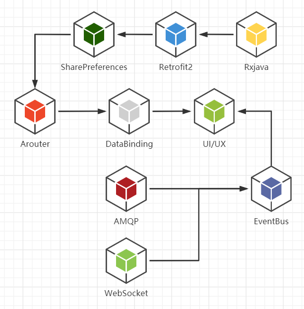

# 基于Android MVVM框架的前端设计

## apk下载

``` bash
http://8.135.100.252/apk/olife-0.6.apk
```

## 框架组件图



## 核心功能

 - 网络请求 - Retrofit2

 - 存储 - SharePreferences

 - 路由 - ARouter

 - 数据绑定 - DataBinding
 
 - 动态渲染 - EventBus

 - 异部事件 - Rxjava
 
 - 消息队列 - AMQP
 
 - 双向通信 - WebScoket

## 需要添加的配置

- Application的build.grade

``` java
buildscript {
    .....
    dependencies {
        classpath 'com.android.tools.build:gradle:3.5.2'
        classpath 'com.jakewharton:butterknife-gradle-plugin:9.0.0'
    }
}

allprojects {
    repositories {
        .....
        maven { url "https://jitpack.io" }
        maven { url 'https://dl.google.com/dl/android/maven2/' }
        mavenLocal()
    }
}
```

- app的build.grade

``` java
android {
    .....
    defaultConfig {
        .....

        dataBinding {
            enabled = true
        }

        javaCompileOptions {
            annotationProcessorOptions {
                arguments = [AROUTER_MODULE_NAME: project.getName(), AROUTER_GENERATE_DOC: "enable"]
            }
        }
    }
   
}

dependencies {
    .....

    /* 修饰器 */
    implementation 'com.jakewharton:butterknife:8.1.0'
    annotationProcessor 'com.jakewharton:butterknife-compiler:8.1.0'

    /* 网络请求 */
    implementation 'com.zhy:okhttputils:2.6.2'
    implementation 'com.squareup.okhttp3:logging-interceptor:3.8.1'
    implementation 'com.squareup.retrofit2:retrofit:2.4.0'
    implementation 'com.squareup.retrofit2:adapter-rxjava2:2.3.0'
    implementation 'com.squareup.retrofit2:converter-gson:2.3.0'

    /* 异步事件 */
    implementation "io.reactivex.rxjava2:rxjava:2.1.0"
    implementation "io.reactivex.rxjava2:rxandroid:2.0.1"
    implementation 'com.github.xuexiangjys:RxUtil2:1.2.0'
    implementation 'com.jakewharton.rxbinding2:rxbinding:2.2.0'
    
    /* 路由 */
    implementation 'com.alibaba:arouter-api:1.4.1'
    annotationProcessor 'com.alibaba:arouter-compiler:1.2.2'
    
    /* 消息总线 */
    implementation 'org.greenrobot:eventbus:3.0.0'
    
    /* 消息队列 */
    implementation 'com.rabbitmq:amqp-client:5.12.0'
    
    /* 双向通信 */
    implementation 'org.java-websocket:Java-WebSocket:1.5.1'
    
    ...
}
```
