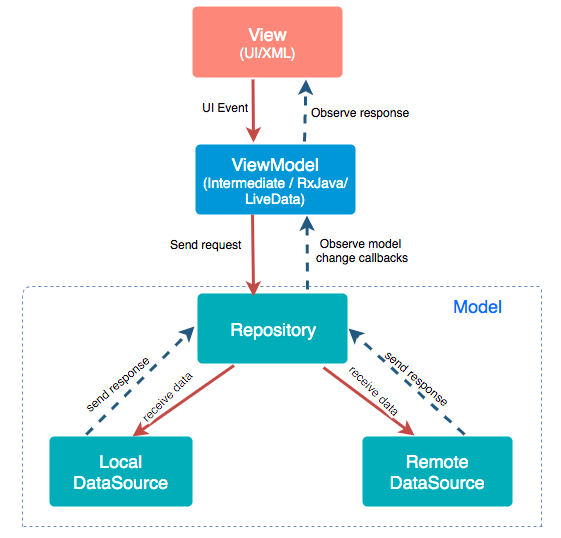
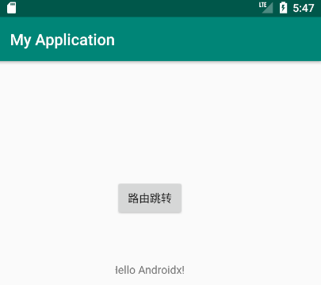

# 2021年基于Android MVVM框架的设计作品

全文环绕项目是project，且MyApplication3已被废弃

## What's Android MVVM architecture?



## 核心功能

 - 网络请求 - okHttp

 - 存储 - SharePreferences

 - 路由 - ARouter

 - 数据绑定 - DataBinding
 
 - 渲染

## 需要添加的全局配置

- Application的build.grade

``` Bash
buildscript {
    .....
    dependencies {
        classpath 'com.android.tools.build:gradle:3.5.2'
        classpath 'com.jakewharton:butterknife-gradle-plugin:9.0.0'
    }
}

allprojects {
    repositories {
        .....
        maven { url "https://jitpack.io" }
        maven { url 'https://dl.google.com/dl/android/maven2/' }
        mavenLocal()
    }
}
```

- app的build.grade

``` Bash
android {
    .....
    defaultConfig {
        .....

        dexOptions {
            preDexLibraries false
            jumboMode true
            javaMaxHeapSize "4g"
            incremental false
        }

        compileOptions {
            sourceCompatibility JavaVersion.VERSION_1_8
            targetCompatibility JavaVersion.VERSION_1_8
        }

        dataBinding {
            enabled = true
        }

        javaCompileOptions {
            annotationProcessorOptions {
                arguments = [AROUTER_MODULE_NAME: project.getName()]
            }
        }
    }
   
}

dependencies {
    .....

    /* 修饰器 */
    implementation 'com.jakewharton:butterknife:8.1.0'
    annotationProcessor 'com.jakewharton:butterknife-compiler:8.1.0'

    /* 网络请求 */
    implementation 'com.squareup.okhttp3:okhttp:4.4.0'
    implementation 'com.zhy:okhttputils:2.6.2'

    /* 路由 */
    implementation 'com.alibaba:arouter-api:1.4.1'
    annotationProcessor 'com.alibaba:arouter-compiler:1.2.2'

    /* 基本布局 */
    implementation 'com.android.support:recyclerview-v7:30+'
    implementation 'com.android.support:design:30+'
    implementation 'com.android.support:cardview-v7:30+'
}
```

## 当前进度

 - 该项目已成功迁移至Androidx
 - 已实现了路由跳转
 - 路由跳转附带的参数可被单向绑定




